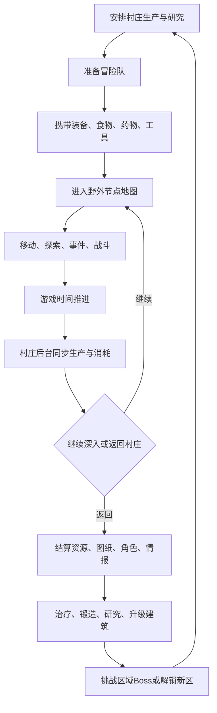

# 《冒险村》完整游戏策划案

> 文件定位：本文件是项目的**核心玩法与产品设计唯一事实来源（Design Source of Truth）**。  
> 建议放置位置：Godot 项目根目录 `/GAME_DESIGN.md`。  
> 适用对象：策划、程序、美术、Codex。  
> 文档版本：v0.2  
> 当前阶段：玩法成长线原型期；战斗基础表现已基本完成，下一阶段优先补齐“冒险产出 → 村庄成长 → 再冒险”的循环。

---

## 0. Codex 阅读与执行规则

Codex 在修改项目之前，必须遵守以下规则：

1. 先阅读本文件，再检查项目现有目录、场景、脚本和数据结构。
2. 本文件描述的是目标设计；现有代码可能只实现其中一部分。
3. 不要因为本文提供了推荐结构，就在未确认的情况下大规模重构现有工程。
4. 新功能应优先复用现有系统、节点和数据，不重复创建同类模块。
5. 每次只完成一个明确阶段，并提供：
   - 修改文件列表；
   - 新增数据结构；
   - 操作和测试方法；
   - 已知问题；
   - 后续建议。
6. 未标记为“已确定”的内容，不要直接实现为最终规则，应先保留接口或向用户确认。
7. 不要擅自增加联网、抽卡付费、离线挂机、永久死亡、复杂基因繁衍、多文明科技树等系统。
8. 任何新增数值都应集中配置，禁止把关键平衡数值散落在多个脚本中。
9. 所有系统都必须服务于核心循环，避免实现只能独立运行、无法互相影响的功能。
10. 每次提交前至少完成静态检查；具备 Godot 运行环境时，再进行场景运行验证。

---

# 1. 游戏概述

## 1.1 暂定名称

**《冒险村》**

## 1.2 游戏类型

- 村庄经营
- 角色培养
- 节点式野外探索
- 四人小队回合制战斗
- 单机、轻量、中小规模

## 1.3 核心一句话

玩家经营一座持续运转的边境村庄：后方村民生产食物、装备、药品与科技，前方冒险者组成队伍探索未知区域、击败怪物并带回资源、图纸、知识和新居民，最终让村庄不断扩张并完成区域开拓目标。

## 1.4 核心体验

本作最重要的氛围不是“所有角色频繁轮岗”，而是：

> **后方一直在生产，前方一直在冒险，两条线同时向前发展。**

玩家离开村庄进入野外后，村庄不会停摆。冒险行为推进游戏时间，村庄在后台同步完成生产、研究、治疗、建造与消耗。

## 1.5 设计关键词

- 村庄持续运转
- 前后方并行
- 低频决策，高反馈
- 后勤支援冒险
- 冒险反哺村庄
- 角色各司其职
- 轻量但有成长感
- 尽量减少重复点击和频繁换岗

---

# 2. 设计边界

## 2.1 本作要做的内容

1. 建造和升级村庄建筑。
2. 安排生活角色在建筑中长期工作。
3. 设定生产队列和阶段性生产政策。
4. 培养冒险角色，配置队伍、装备和补给。
5. 在节点地图上探索、战斗、处理事件。
6. 将冒险成果带回村庄，解锁新成长。
7. 用村庄成长支持更深层的探索。
8. 通过区域 Boss 和章节目标推动游戏进程。

## 2.2 当前版本明确不做

- 基因繁衍与血统遗传
- 多文明、多时代的大型科技演化
- 复杂婚姻与家族系统
- 所有角色自由切换生产/战斗职业
- 真实时间或离线挂机生产
- 角色永久死亡
- 大地图自由移动开放世界
- 多人联机
- 大规模即时战斗
- 强付费抽卡逻辑

## 2.3 操作复杂度原则

- 生活角色岗位以长期固定为主，玩家不需要每天重新排班。
- 冒险队以稳定编成为主，玩家只在目标或战术变化时调整。
- 经营决策集中在“生产方向、资源优先级、建筑成长、远征准备”。
- 避免频繁收菜、频繁弹窗、频繁往返多个界面。

---

# 3. 核心玩法循环



## 3.1 短循环：单次节点行动

1. 选择下一个节点。
2. 消耗一定游戏时间和补给。
3. 触发战斗、事件、采集或休整。
4. 村庄后台推进相同时间。
5. 玩家判断继续深入或返程。

## 3.2 中循环：单次远征

1. 确定目标区域。
2. 编成四人队伍。
3. 配置装备与后勤物资。
4. 探索多个节点。
5. 获取资源、图纸、科技信息和角色线索。
6. 回村结算。
7. 消化成果并准备下一次远征。

## 3.3 长循环：区域开拓

1. 发现新区域。
2. 通过多次远征收集信息与资源。
3. 村庄研发针对性科技和后勤物资。
4. 解锁通路、营地或特殊工具。
5. 击败区域 Boss。
6. 将区域转化为稳定资源来源。
7. 开启下一章节。

---

# 4. 游戏时间与并行运行

## 4.1 时间模型（已确定）

本作采用**统一游戏时间**，不采用现实时间挂机。

时间只在以下行为发生时推进：

- 地图移动
- 节点探索
- 战斗结算
- 采集
- 休整
- 扎营
- 返程
- 特殊事件

玩家停留在菜单、查看属性或思考策略时，时间不推进。

## 4.2 推荐时间单位

MVP 推荐使用“天”为最小结算单位；后续可细化为半天或时段。

示例：

| 行为 | 时间消耗 |
|---|---:|
| 相邻节点移动 | 1天 |
| 普通战斗 | 1天 |
| 搜索遗迹 | 1天 |
| 扎营恢复 | 1天 |
| 长距离返程 | 2～4天 |

具体数值必须配置化。

## 4.3 村庄后台结算

每当游戏时间推进，村庄同步处理：

- 农田产出
- 资源收集
- 食物加工
- 武器制造
- 防具制造
- 科研进度
- 医院治疗
- 建筑建设或升级
- 村民食物消耗
- 订单和生产队列
- 村庄事件计时

## 4.4 冒险中的村庄反馈

冒险界面应显示简化村庄状态，例如：

- 当前日期
- 粮食库存
- 药品库存
- 研究剩余时间
- 制造剩余时间
- 是否出现重大事件

普通产出不打断冒险；只有以下情况允许明显提醒：

- 粮食即将耗尽
- 关键研究完成
- 重要装备完成
- 新居民出现
- 建筑事故
- 村庄受到威胁

---

# 5. 村庄经营系统

## 5.1 核心目标

村庄不是独立的“收菜模块”，而是冒险队的后勤基地。经营的主要价值是：

- 提供稳定资源
- 制作战斗和探索物资
- 解锁装备、科技和地图能力
- 治疗伤员
- 吸引和培养新角色
- 支持章节目标

## 5.2 建筑列表（当前规划）

### 5.2.1 农田

功能：

- 提供基础粮食
- 种植不同农作物
- 为食物坊提供原料

等级建议：

- 1级：3块种植地
- 2级：4块种植地
- 3级：6块种植地

### 5.2.2 资源收集所

功能：

- 提供木材、石材等基础建设资源
- 解锁已征服区域的自动资源采集
- 提高资源运输和储存效率

### 5.2.3 食物坊

功能：

- 加工粮食
- 维持村庄食物供给
- 制作冒险补给与战斗料理

可制作物示例：

- 普通口粮
- 长途干粮
- 恢复料理
- 抗寒料理
- 抗热料理
- 临时攻击增益料理

### 5.2.4 科研所

功能：

- 研究建筑科技
- 研究生产科技
- 研究冒险科技
- 研究装备科技
- 解析野外带回的遗物与知识

### 5.2.5 武器作坊

功能：

- 制作各类武器
- 根据图纸解锁新品类
- 根据科技提升品质或解锁高级类型

当前方向示例：

- 初期：刀、剑、弓等基础武器
- 中期：法杖、火枪或特殊武器

### 5.2.6 防具作坊

功能：

- 制作各类防具
- 根据图纸解锁新品类
- 根据科技提升品质与特殊抗性

### 5.2.7 医院

功能：

- 恢复角色生命和伤势
- 缩短受伤角色的不可用时间
- 生产或强化医疗物资

## 5.3 建筑等级

所有核心建筑初始为1级，原则上最多3级。

升级通常消耗：

- 基础资源
- 稀有资源
- 科技条件
- 建设时间

升级应带来至少一种明显变化：

- 增加岗位
- 增加队列
- 提高产量
- 解锁配方
- 解锁功能
- 改变建筑外观

## 5.4 建筑改造

达到特定等级和科技后，可进行方向性改造。

改造原则：

- 不要求每个建筑在MVP阶段都有多分支。
- 分支必须改变玩法，而不是单纯增加数值。
- 分支应尽量形成不同村庄发展路线。

示例：

- 武器作坊：精工路线 / 量产路线 / 魔能路线
- 食物坊：民生路线 / 远征路线 / 精品料理路线
- 科研所：生产优先 / 战斗优先 / 探索优先

## 5.5 生产政策

为减少频繁微操，建筑允许设置长期生产政策。

示例：

### 食物坊

- 民生优先：确保村庄口粮
- 远征储备：优先生产干粮
- 精品制作：消耗稀有材料制作强力料理

### 武器作坊

- 农具优先：提高村庄生产效率
- 普通装备：快速武装新冒险者
- 高级锻造：集中资源制作高品质装备
- 维修模式：优先修复受损装备

---

# 6. 角色系统

## 6.1 角色分工（已确定）

生活角色和战斗角色默认是两类不同角色。

### 生活角色

- 长期驻留村庄
- 负责生产、制造、科研和治疗
- 不要求玩家频繁调去战斗

### 战斗角色

- 负责探险和战斗
- 主要通过装备、技能、属性和队伍搭配成长
- 不要求玩家频繁调去生产

两类角色可以通过任务、装备、治疗、委托、剧情和关系事件产生联系，但不以频繁换岗为核心玩法。

## 6.2 初始角色

当前规划：

- 4名生活角色
- 4名战斗角色

初始角色应覆盖基础功能，避免开局因随机结果无法运行核心系统。

## 6.3 能力结构

每个角色配置若干能力项。角色面板显示字母评级，内部使用具体数值。

评级：

- C
- B
- A
- S
- S+

### 6.3.1 生活能力

| 能力 | 作用 |
|---|---|
| 烹饪 | 影响料理效率与品质 |
| 科研 | 影响科技研究速度 |
| 锻造 | 影响装备制造效率与品质 |
| 治疗 | 影响角色恢复效率 |
| 种植 | 影响农田产量 |
| 采集 | 影响资源收集速度 |

### 6.3.2 战斗能力

| 能力 | 作用 |
|---|---|
| 力量 | 影响物理攻击 |
| 智力 | 影响魔法攻击与部分技能 |
| 体力 | 影响生命值和生存能力 |
| 速度 | 影响行动顺序及部分闪避逻辑 |

## 6.4 能力显示原则

角色面板可显示“A级科研”等抽象评级，但实际操作界面应提供可理解结果，例如：

- 预计完成时间
- 预计产量
- 预计品质区间
- 预计治疗天数

## 6.5 特性标签

标签用于体现角色个性和特殊机制。

### 生活标签示例

- 食神：制作普通料理时，有概率提升为高品质料理
- 神农：种植时有概率获得额外种子
- 博学：研究完成后有概率获得额外知识
- 鬼斧神工：锻造时更容易出现特殊词条
- 天生牛马：提高基础资源采集效率

### 战斗标签示例

- 天生神力：物理攻击时获得额外伤害
- 皮糙肉厚：受击时降低部分伤害
- 雷神：提高雷系技能效果
- 火神：提高火系技能效果
- 天使：提高治疗技能效果
- 鹰眼：提高暴击率或命中率

标签不应只做重复数值。优先设计“改变规则、触发特殊效果”的标签。

## 6.6 标签品质（待确认）

原始方案包含：

- 蓝色
- 紫色
- 橙色

MVP是否保留标签品质尚未最终确定。Codex不得在未确认前制作复杂的标签品质成长系统，可先预留字段。

## 6.7 招募方式

当前可采用的来源：

- 开局固定角色
- 村庄定期出现候选人
- 野外冒险事件
- 完成任务后加入
- 特殊角色救援
- 酒馆招募券（保留但不作为强付费抽卡设计）

推荐规则：

- 每隔固定游戏时间，村庄出现3名候选人，玩家选择其中1名。
- 特殊角色主要通过冒险事件获取。
- 村庄发展方向影响候选人类型。

## 6.8 导师学习（后期系统，暂缓）

原始规划：

- 角色可以指定导师学习约60个时间单位。
- 可提高某项能力。
- 学习上限受到导师能力限制。
- 有概率获得导师的特殊标签。

该系统不属于MVP优先内容。当前只需在角色数据中预留成长和学习接口，不直接实现完整导师系统。

---

# 7. 野外冒险系统

## 7.1 地图结构

采用节点式地图，不采用自由移动开放世界。

每个区域包含：

- 入口节点
- 3～6个普通节点
- 分支路线
- 资源节点
- 事件节点
- 营地或恢复点
- 精英节点
- Boss遗迹节点

## 7.2 节点类型

| 节点 | 功能 |
|---|---|
| 战斗节点 | 触发普通怪物战斗 |
| 精英节点 | 更高难度与更好奖励 |
| 资源节点 | 获得材料、种子、矿物等 |
| 事件节点 | 角色、选择、风险与奖励 |
| 营地节点 | 恢复、存档或补给管理 |
| 遗迹节点 | 图纸、科技、剧情和解谜 |
| Boss节点 | 区域最终挑战 |

## 7.3 冒险目标

冒险产出不应只有通用资源，还应包括：

- 建筑升级材料
- 武器图纸
- 防具图纸
- 科技资料
- 新种子
- 稀有矿石
- 新角色
- 地图信息
- 特殊工具
- 章节关键物品

## 7.4 补给系统

远征前需要配置：

- 食物
- 药物
- 装备
- 探索工具
- 特殊环境物资

补给决定：

- 可探索距离
- 可持续天数
- 战斗恢复能力
- 是否能进入特殊节点
- 是否能获取特定资源

示例：

- 绳索：进入悬崖路线
- 火把：探索黑暗遗迹
- 采矿工具：采集矿脉
- 解毒药：进入毒沼
- 抗寒料理：降低雪地区域惩罚

## 7.5 手动探索与自动派遣

### 手动探索

用于：

- 首次进入区域
- 剧情节点
- 特殊事件
- 精英战
- Boss战
- 稀有奖励

### 自动派遣

区域被初步清理后可解锁。

自动派遣主要获得：

- 基础资源
- 常规材料
- 少量经验

自动派遣原则上不直接获得：

- 首次通关奖励
- 关键剧情道具
- 特殊角色
- 唯一图纸
- Boss奖励

## 7.6 多队伍

当前目标：

- 玩家可组建1支主力小队。
- 后续可解锁额外派遣小队。
- 每支队伍最多4人。

MVP阶段不要同时实现过多队伍管理。

## 7.7 失败与撤退

战斗失败不造成永久死亡。

失败可能产生：

- 本次战利品减少或丢失
- 角色受伤
- 装备耐久下降
- 消耗补给
- 强制返村
- 获得少量敌人情报

玩家可以主动撤退，以保留部分成果。

---

# 8. 战斗系统

## 8.1 战斗形式

- 四人小队
- 回合制
- 玩家控制己方角色
- 敌方由AI控制
- 前后排站位
- 根据速度计算行动顺序

## 8.2 站位

当前战场设计：

- 前排4个可用位置
- 后排4个可用位置
- 每方实际最多上阵4个单位

站位影响：

- 近战攻击范围
- 远程保护
- 受击优先级
- 部分技能范围
- Boss技能目标

## 8.3 基础行动

每个行动回合可选择：

- 普通攻击
- 主动技能
- 防御
- 使用物品（是否保留待平衡）
- 特殊/终极技能（满足条件后）

## 8.4 推荐最小战斗资源

MVP建议使用：

- 生命值 HP
- 技能冷却或技能点（二选一，避免同时复杂化）
- 终极能量（可选）

不要在早期同时加入法力、怒气、体力、行动点、连击点等多套资源。

## 8.5 职业方向

角色具有职业倾向，但不要求在MVP阶段制作复杂转职树。

基础定位建议：

- 战士：前排物理输出/承伤
- 游侠：后排远程输出
- 法师：魔法与范围输出
- 治疗者：恢复与增益

## 8.6 怪物与Boss

当前资源路径：

- 树精Boss：`res://assets/art/boss/ShuJing.png`
- 火元素Boss：`res://assets/art/boss/HuoYuanSu.png`
- 普通小怪：`res://assets/art/monster/monster01.png`

所有角色和怪物原则上具备：

- 待机
- 攻击
- 受击
- 死亡

Boss设计方向：

### 树精Boss

- 使用地刺攻击
- 地刺从目标脚下穿出
- 强调区域威胁和预警

### 火元素Boss

- 召唤陨石攻击
- 陨石从空中落下
- 强调延迟打击和范围威胁

### 普通小怪

- 当前方向：史莱姆类怪物
- 可使用泡泡攻击

## 8.7 战斗设计目标

战斗不追求极度复杂，重点是：

- 队伍搭配
- 前后排站位
- 技能配合
- 装备成长
- 冒险前后勤准备
- Boss机制应对

---

# 9. 装备系统

## 9.1 装备来源

- 村庄制造
- 冒险掉落
- Boss奖励
- 特殊事件

村庄制造应是稳定来源，野外掉落应提供惊喜和稀有变化。

## 9.2 装备基础结构

MVP优先：

- 武器
- 防具

后续可扩展：

- 饰品
- 工具
- 特殊装备

## 9.3 装备属性

装备包含：

- 固定基础属性
- 品质
- 可选技能词条或特殊词条

示例：

- 武器：攻击、魔法攻击、速度修正
- 防具：防御、生命、抗性
- 词条：火伤强化、治疗强化、受击护盾等

## 9.4 图纸与科技

- 图纸决定“能否制造某类装备”。
- 科技决定“制造效率、品质上限或高级类型”。
- 稀有材料决定“能否制造高级版本”。

## 9.5 装备制造原则

- 不做过于复杂的随机词条海洋。
- 固定属性保证装备容易理解。
- 少量特殊词条形成构筑差异。
- 制作结果应有清晰的预览区间。

---

# 10. 科研系统

## 10.1 科研定位

科研用于连接冒险发现与村庄成长，不制作大型文明演化树。

## 10.2 科技分类

### 生产科技

- 农田增产
- 资源采集
- 加工效率
- 仓储容量

### 冒险科技

- 补给改良
- 特殊工具
- 环境抗性
- 派遣效率

### 战斗科技

- 新武器类型
- 新防具类型
- 装备品质
- 药物与战斗料理

## 10.3 科研输入

- 时间
- 科研角色
- 基础资源
- 冒险带回的知识或遗物
- 前置科技

## 10.4 科研输出

- 新配方
- 新建筑功能
- 建筑改造
- 装备类型
- 地图通行能力
- 生产效率提升

---

# 11. 资源与经济

## 11.1 基础资源

建议至少包含：

- 粮食
- 木材
- 石材
- 金属
- 药材

## 11.2 加工资源

- 干粮
- 料理
- 药品
- 武器部件
- 防具部件
- 研究资料

## 11.3 稀有资源

- Boss材料
- 魔法矿石
- 遗迹核心
- 稀有种子
- 特殊图纸

## 11.4 资源设计原则

- 每种资源至少对应一个明确用途。
- 避免只为升级而存在的无意义货币。
- 同一资源不要同时承担过多用途，避免玩家无法做决定。
- 稀有资源应推动关键选择，而不是单纯堆数量。

## 11.5 经济压力来源

- 村民日常食物消耗
- 建筑升级
- 装备制造
- 冒险补给
- 角色治疗
- 科研投入

游戏应允许玩家稳定发展，但不能所有项目同时满速推进。

---

# 12. 前后方连接设计

生活角色与战斗角色不共用岗位，但两条线必须通过以下方式持续连接。

## 12.1 后勤连接

村庄向冒险队提供：

- 食物
- 药品
- 装备
- 工具
- 科技
- 治疗

## 12.2 资源连接

冒险队向村庄带回：

- 原材料
- 图纸
- 科技资料
- 种子
- 新居民
- 地图情报

## 12.3 委托连接

前线会提出具体需求：

- 制作抗寒料理
- 研发解毒药
- 打造破甲武器
- 解析遗迹文字
- 制作桥梁或开路工具

## 12.4 人物连接

- 工匠为特定冒险者打造专属装备
- 医生治疗受伤冒险者
- 学者研究冒险者带回的遗物
- 村民发布寻找亲人或资源的任务
- 冒险者完成村民个人委托

人物连接强调世界感，不要求频繁改变角色岗位。

---

# 13. 章节与最终目标

## 13.1 章节结构模板

每个区域章节建议包含：

1. 村庄出现一个发展瓶颈。
2. 玩家得知某个野外区域可能解决问题。
3. 进行数次探索，收集信息和资源。
4. 村庄研究针对性科技或制造特殊物资。
5. 解锁Boss路线。
6. 击败区域Boss。
7. 区域转化为稳定资源地或新功能。
8. 开启下一章节。

## 13.2 示例章节

### 第一章：森林开拓

目标：解决村庄食物与木材短缺。

- 探索森林
- 获得新种子
- 发现木材资源点
- 制作基础补给
- 击败树精Boss
- 解锁森林资源派遣

### 第二章：火山遗迹

目标：获得高级矿石与火焰科技。

- 研发抗热料理
- 制作耐火防具
- 探索火山路线
- 击败火元素Boss
- 解锁火山矿石和火系装备

## 13.3 最终目标

最终目标需要具象化，避免只有“把村庄升满”。

可选方向：

- 修复远古传送门
- 重建魔法灯塔
- 建成完整的边境冒险据点
- 打通所有区域贸易与交通

最终目标尚未完全锁定，MVP阶段以完成两个区域章节为主要验证目标。

---

# 14. UI与玩家流程

## 14.1 村庄主界面

需要显示：

- 村庄场景
- 建筑入口
- 当前日期
- 主要资源
- 生产/研究提示
- 冒险入口
- 角色入口

## 14.2 建筑界面

需要显示：

- 建筑等级
- 工作角色
- 生产队列
- 生产政策
- 升级条件
- 可用配方
- 预计完成时间

## 14.3 冒险准备界面

需要显示：

- 队伍成员
- 前后排位置
- 装备
- 补给
- 目标区域
- 预计路程
- 推荐抗性或工具

## 14.4 地图界面

需要显示：

- 节点连线
- 队伍当前位置
- 已探索节点
- 未知节点
- 补给与剩余天数
- 村庄简报
- 返回村庄按钮

## 14.5 战斗界面

需要显示：

- 前后排单位
- 行动顺序
- 生命值
- 技能按钮
- 目标选择
- 状态效果
- Boss预警

## 14.6 回村结算界面

需要显示：

- 冒险天数
- 带回资源
- 新图纸/科技
- 角色经验和伤势
- 村庄期间完成事项
- 重大村庄事件

---

# 15. MVP范围

## 15.1 MVP目标

验证以下体验是否成立：

> 玩家在村庄安排生产后，带领队伍冒险；冒险过程中村庄同步运行；回村后，冒险成果能够明显推动建筑、装备和角色成长。

## 15.2 MVP内容规模

### 村庄

- 6～7座核心建筑
- 每座建筑1～2级
- 基础生产队列
- 简单岗位系统
- 游戏时间结算

### 角色

- 4名生活角色
- 4名战斗角色
- 4种战斗定位
- 基础能力和标签

### 冒险

- 1张森林节点地图
- 4～6个普通节点
- 1个Boss节点
- 1种普通怪物
- 1个树精Boss

### 战斗

- 四人回合制
- 前后排
- 普通攻击
- 1～2个角色技能
- 防御
- 基础状态效果

### 成长

- 1条基础科研线
- 3～5件武器
- 3～5件防具
- 3种料理或药品
- 1次建筑升级

## 15.3 MVP暂不实现

- 多区域同时派遣
- 复杂建筑改造树
- 导师系统
- 大量随机标签
- 多阶段转职
- 大量装备词条
- 多结局
- 复杂关系系统

---

# 16. 当前原型状态

根据最近确认内容：

1. 村庄场景和野外探索方向已建立。
2. 战斗基础流程已基本实现。
3. 角色、普通怪物和Boss已有待机、攻击、受击、死亡表现。
4. 树精Boss与火元素Boss已有基础视觉资源。
5. 当前优先级已经从单纯完善表现，转向建立玩法成长线。

Codex必须先检查仓库确认实际完成度，不得只依据本节推断代码状态。

---

# 17. 推荐开发阶段

## 阶段A：统一游戏状态与时间

目标：

- 建立统一游戏时间
- 冒险行动可以推进时间
- 村庄生产可以按时间结算
- 保存当前日期和资源

验收：

- 在野外推进3天后回村，村庄正确获得3天产出。
- 菜单停留不会推进时间。

## 阶段B：最小村庄生产循环

目标：

- 农田产粮
- 资源所产木材/石材
- 食物坊生产干粮
- 岗位角色影响效率

验收：

- 玩家能配置岗位和队列。
- 生产结果可预测、可结算、可保存。

## 阶段C：冒险补给与消耗

目标：

- 出发前携带干粮和药物
- 移动和战斗消耗时间与补给
- 补给不足时限制继续探索

验收：

- 村庄生产的物资能直接影响远征距离和安全性。

## 阶段D：冒险产出反哺村庄

目标：

- 战斗和节点掉落材料
- 获得图纸或科技资料
- 回村解锁新配方或升级

验收：

- 完成一次远征后，玩家能获得至少一个明显成长选择。

## 阶段E：完整森林章节

目标：

- 森林节点图
- 普通怪物
- 树精Boss
- 区域奖励
- 通关后自动派遣

验收：

- 从开局到击败Boss形成可重复测试的完整闭环。

## 阶段F：角色、装备与标签扩展

目标：

- 完善角色能力
- 装备制造
- 少量特殊标签
- 队伍搭配差异

## 阶段G：第二章节

目标：

- 火山区域
- 抗热后勤
- 火元素Boss
- 新装备和科技

---

# 18. 推荐 Godot 数据与模块结构

> 以下是建议，不代表必须重构现有项目。Codex应优先适配当前仓库。

## 18.1 核心单例建议

- `GameState`：全局进度、当前日期、章节状态
- `TimeSystem`：时间推进与结算通知
- `InventorySystem`：资源、道具、装备库存
- `VillageSystem`：建筑、岗位、生产队列
- `ExpeditionSystem`：队伍、补给、地图进度
- `SaveManager`：存档与读档
- `EventBus`：跨系统事件

## 18.2 数据资源建议

可使用 Godot `Resource` 或集中JSON配置：

- `CharacterData`
- `CharacterRuntimeState`
- `BuildingData`
- `BuildingRuntimeState`
- `RecipeData`
- `ItemData`
- `EquipmentData`
- `SkillData`
- `MonsterData`
- `MapNodeData`
- `RegionData`
- `TechnologyData`
- `TraitData`

静态配置与运行状态必须分离。

## 18.3 推荐目录

```text
res://
├─ assets/
├─ scenes/
│  ├─ village/
│  ├─ adventure/
│  ├─ battle/
│  ├─ characters/
│  └─ ui/
├─ scripts/
│  ├─ core/
│  ├─ village/
│  ├─ adventure/
│  ├─ battle/
│  └─ ui/
├─ data/
│  ├─ characters/
│  ├─ buildings/
│  ├─ items/
│  ├─ skills/
│  ├─ monsters/
│  ├─ regions/
│  └─ technologies/
└─ saves/
```

## 18.4 关键事件建议

```text
time_advanced(days)
production_completed(building_id, recipe_id)
research_completed(technology_id)
expedition_started(team_id, region_id)
map_node_resolved(node_id, result)
battle_finished(result)
expedition_returned(report)
character_injured(character_id, injury)
item_unlocked(item_id)
building_upgraded(building_id, level)
```

---

# 19. 数据示例

以下示例只用于表达字段，不要求直接照搬。

## 19.1 生活角色

```json
{
  "id": "worker_blacksmith_01",
  "name": "阿石",
  "role_type": "worker",
  "abilities": {
    "forging": 78,
    "gathering": 42,
    "research": 25
  },
  "traits": ["master_craft_hint"],
  "assigned_building": "weapon_workshop",
  "status": "working"
}
```

## 19.2 战斗角色

```json
{
  "id": "adventurer_warrior_01",
  "name": "洛恩",
  "role_type": "adventurer",
  "class_id": "warrior",
  "combat_stats": {
    "strength": 75,
    "intelligence": 20,
    "vitality": 80,
    "speed": 45
  },
  "traits": ["tough_skin"],
  "equipment": {
    "weapon": "iron_sword",
    "armor": "leather_armor"
  }
}
```

## 19.3 建筑

```json
{
  "id": "farm",
  "level": 1,
  "worker_slots": 1,
  "production_queue": [
    {
      "recipe_id": "grow_wheat",
      "remaining_days": 2
    }
  ],
  "policy": "village_supply"
}
```

## 19.4 地图节点

```json
{
  "id": "forest_node_03",
  "region_id": "forest_01",
  "node_type": "battle",
  "time_cost_days": 1,
  "encounter_id": "slime_group_01",
  "rewards": ["wood", "herb"],
  "first_clear_rewards": ["forest_map_fragment"]
}
```

---

# 20. 验收标准

## 20.1 核心循环验收

一次完整测试必须能够完成：

1. 在村庄安排生产。
2. 制作至少一种冒险补给。
3. 选择四名冒险者出发。
4. 探索至少三个节点。
5. 完成一次战斗。
6. 时间推进且村庄同步生产。
7. 返回村庄。
8. 结算冒险奖励和村庄产出。
9. 使用奖励完成至少一次成长。

## 20.2 操作体验验收

- 玩家不需要为了每次出发而重新安排全部生活角色。
- 村庄不会因为进入冒险界面而停止。
- 玩家可以理解资源从哪里来、用到哪里。
- 冒险奖励能产生明显的新目标。
- 失败存在代价，但不会导致大量进度永久丢失。

## 20.3 技术验收

- 所有关键数值配置化。
- 静态数据与运行状态分离。
- 时间推进只有一个权威入口。
- 存档能恢复村庄、角色、库存、地图和时间状态。
- 不因场景切换重复结算生产。

---

# 21. 待确认事项

以下内容尚未完全锁定，未经确认不要直接做成复杂系统：

1. 最终目标是传送门、灯塔还是其他大型工程。
2. 标签是否保留蓝、紫、橙品质。
3. 战斗使用技能冷却还是技能点。
4. 是否保留战斗中使用消耗品。
5. 酒馆招募券占多大比重。
6. 导师学习的具体时长和继承规则。
7. 建筑改造是可逆、永久二选一，还是允许多分支共存。
8. 装备耐久是否进入正式版本。
9. 自动派遣是否允许角色受伤。
10. 前后排8个位置的具体站位规则。

---

# 22. 设计优先级

当不同功能发生冲突时，按照以下顺序取舍：

1. 核心循环是否完整
2. 前后方是否真正互相影响
3. 操作是否简洁
4. 成长是否清晰
5. 角色是否有差异
6. 战斗是否有策略
7. 内容数量
8. 表现丰富度

不允许为了增加内容数量，破坏前四项。

---

# 23. Codex 单次任务模板

后续向 Codex 发布任务时，可以使用以下格式：

```text
请先阅读项目根目录 GAME_DESIGN.md。

本次只实现：【阶段/系统名称】。
目标：
1. ...
2. ...

必须复用：
- 现有的 ...

禁止修改：
- ...

验收条件：
1. ...
2. ...

完成后请输出：
1. 修改文件清单；
2. 关键逻辑说明；
3. Godot中的测试步骤；
4. 尚未解决的问题。
```

---

# 24. 文档维护规则

- 玩法发生正式变更时，先修改本文件，再修改实现。
- 已废弃设计必须明确标注或删除，避免Codex同时读取冲突规则。
- 每完成一个开发阶段，更新“当前原型状态”。
- 临时测试数值不应写成最终设计结论。
- 新系统必须说明它如何连接村庄与冒险核心循环。

---

**文档结束。**
